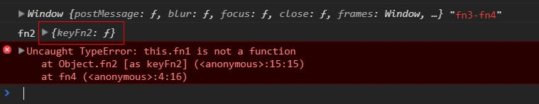
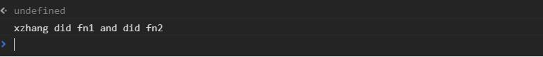
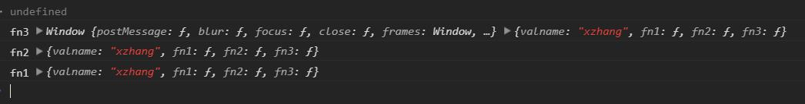

`this`对于当时刚接触js的人来说幽灵一般的存在，就是老司机也不免有大意翻车的时候，印象中很多前端面试的基础部分考察`prototype`和`this`是必不可少的。
前几天改一个bug改出`this`的问题，大意翻车，虽然很快就解决了，但还是警醒下自己，温习梳理以免再出错。
问题类似下面的代码块，对象外提取公共模块导入，对象内部方法和属性通过对象传参`params`的方式进入`setTime`方法执行业务逻辑。

function setTime(params){
	setTimeout(function fn4() {
        params.keyFn2();
    },0)
}
var obja={
	valname: 'xzhang',
	fn1(){
		return this.valname + ' did fn1';
	},
	fn2(){
		return this.fn1()+' and did fn2';
	},
	fn3(){
        setTime({
            keyFn2: this.fn2
        });
	}
}
obja.fn3();

但是执行后报错，`fn2`方法是执行过后，但是里面却找不到`fn1`这个方法，看到这个bug一脸懵逼。
老司机也会翻车好像说的就是我，当时就想当然的的认为(以下是错误思考过程)`fn2`通过`this.fn2`传参进入，`this`也会传进去，所以`this.fn1`的`this`理所应当的指向`obja`,所有的方法都会找到自己的对象宿主去执行（错误思考过程结束），还是因为懒，思想都不愿意往前多想一步。
遇到问题总是要解决的。
先思考后动手是我的习惯，这里报错很显然是`this`指向出现了问题，找到这个问题根源，也就不难发现根源在哪里、怎么去解决了。
so...
万年不变的`console`调式大法

function setTime(params){
	setTimeout(function fn4() {
        console.log(this, 'fn3-fn4');
        params.keyFn2();
    },0)
}
var obja={
	valname: 'xzhang',
	fn1(){
        console.log('fn1',this);
		return this.valname + ' did fn1';
	},
	fn2(){
        console.log('fn2',this);
		return this.fn1()+' and did fn2';
	},
	fn3(){
        setTime({
            keyFn2: this.fn2
        });
	}
}
obja.fn3();

结果如下：

果不其然`fn2`中的`this`指向出现了问题，所以找不到`fn1`方法很正常。错误的`this`指向了一个对象，既不是`windows`也不是`obja`，而是`{keyFn2: f}`，看着好眼熟，嗯？这个对象不就是我们`setTime`传进去的对象参数`params`么?
再看看`fn4`里的调用方法`params.keyFn2()`,所以一切都很明了了：`setTime`里的`keyFn2`方法能够通过`this.fn2`传参进去，方法能够得到执行，但是`fn2`方法里面还有`this`，这个`this`的指向就有问题了，它指向的是调用这个方法的`params`也就是`{keyFn2: f}`，这个对象里根本没有`fn1`方法！
进一步`fn1`就算得到执行，方法里面的依然有`this`的问题，所以也得进行手动指向。
<mark>如果想得到正确的结果必须明确`this`的指向。</mark>

function setTime(params){
	setTimeout(function fn4() {
        console.log(params.keyFn2(params.self));
    },0)
}
var obja={
	valname: 'xzhang',
	fn1(s){
        const self = s? s : this;
		return self.valname + ' did fn1';
	},
	fn2(s){
        const self = s? s : this;
		return self.fn1(s)+' and did fn2';
	},
	fn3(){
        setTime({
            keyFn2: this.fn2,
            self: this
        });
	}
}
obja.fn3();


大功告成，到这里bug就算修复完毕了，但是思考一个问题，我们工作就是为了码代码，修复bug的么？ <mark>这个是不是最佳的处理方式呢？</mark>

上面的代码没有提取公共模块之前是下面这么写的，一点问题都没有，`this`指向正常，除了通过`_this`纠正了`es5`的指向，其他并不需要操心。
但是需要使用额外的外界方法，并且方法中涉及`this`指向的问题就需要小心了。

var objb={
	valname: 'xzhang',
	fn1(){
        console.log('fn1',this);
		return this.valname + ' did fn1';
	},
	fn2(){
        console.log('fn2',this);
		return this.fn1()+' and did fn2';
	},
	fn3(){
		const _this = this;
		setTimeout(function fn4() {
			console.log("fn3", this, _this);
			console.log(_this.fn2());
		},0)
	}
}
objb.fn3();


>原创内容，欢迎交流转载请注明出处